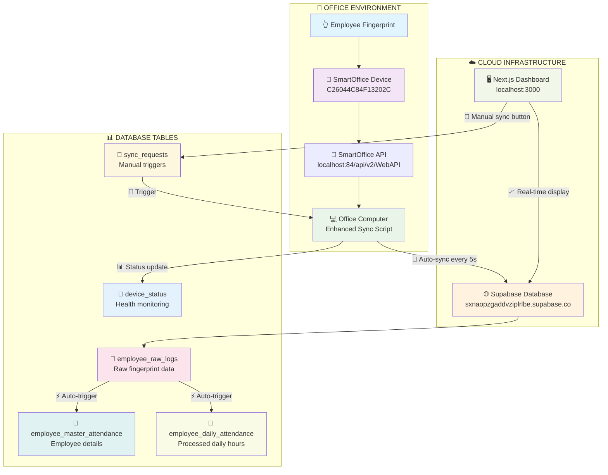
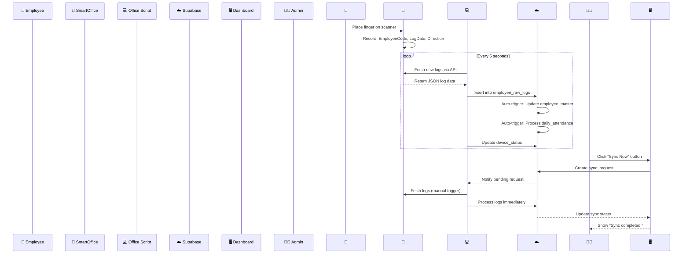
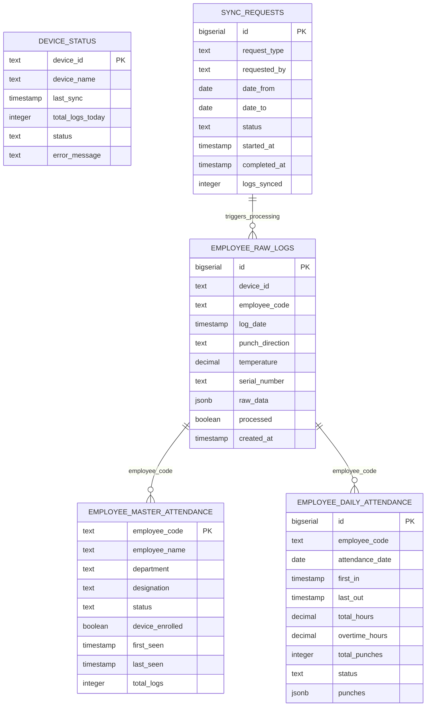
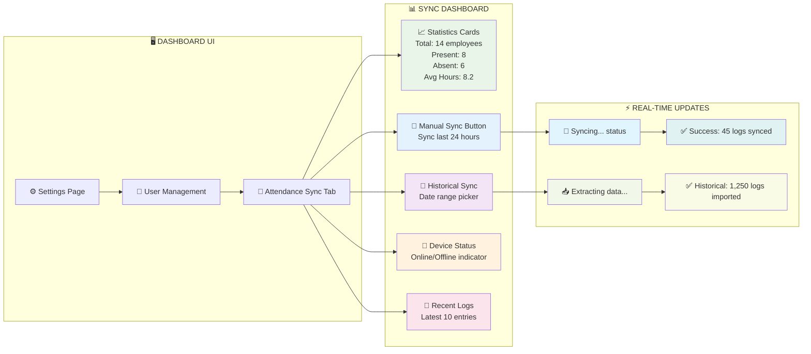
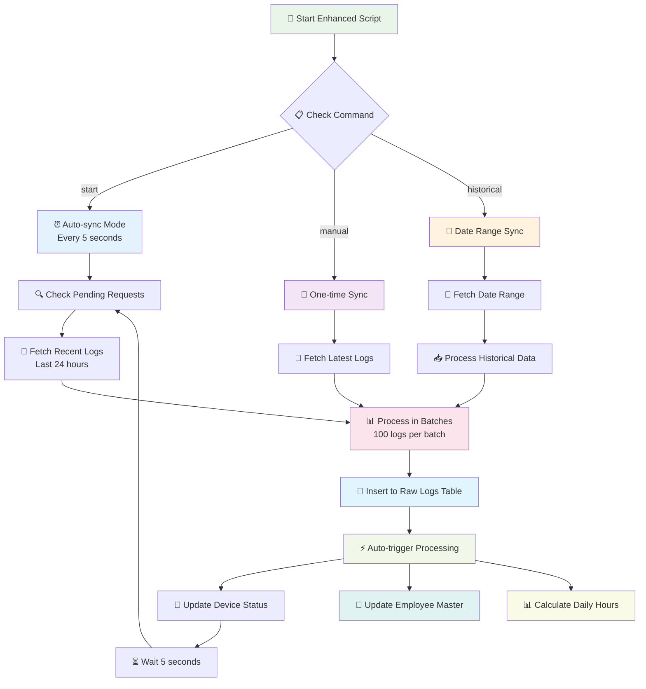
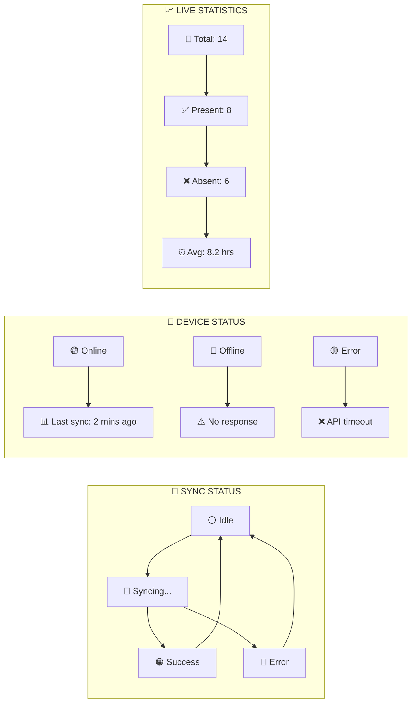
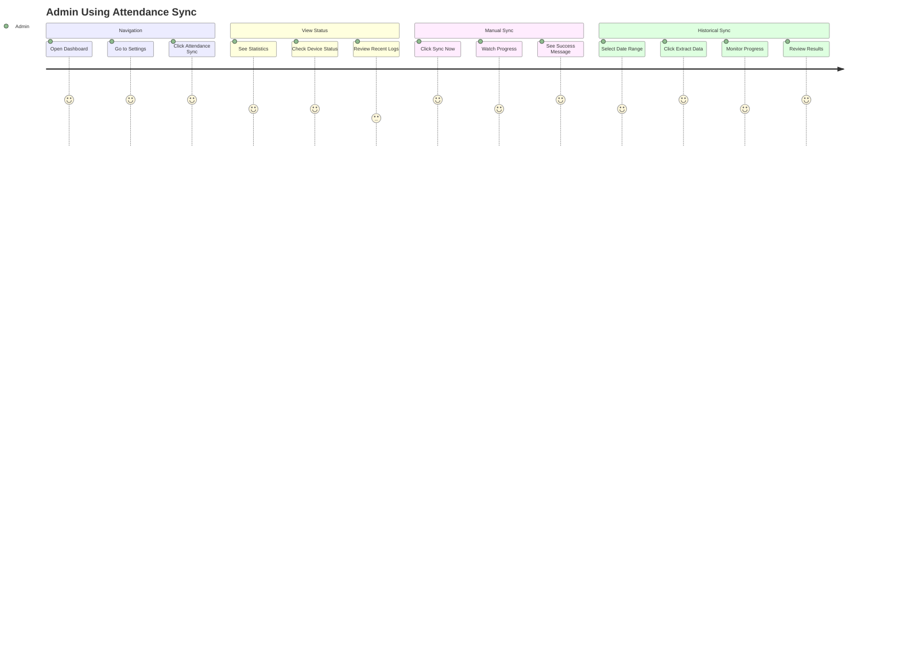
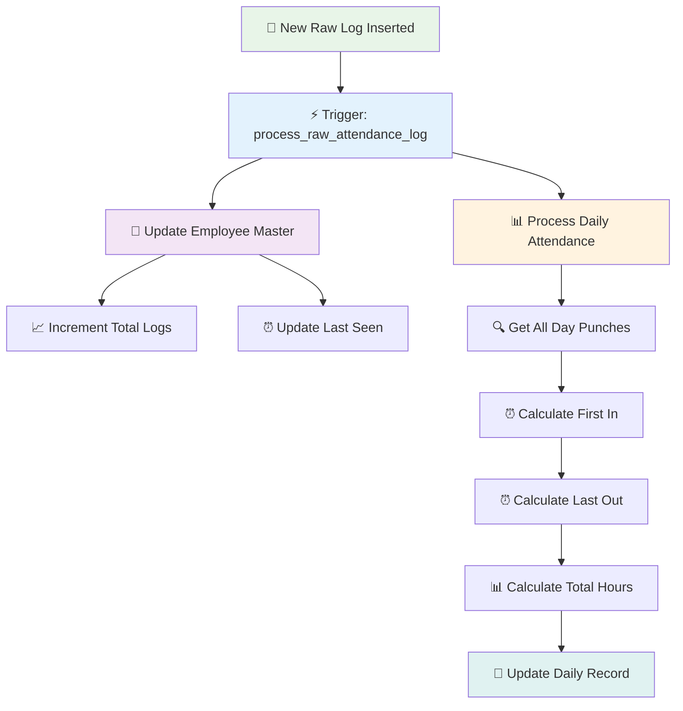
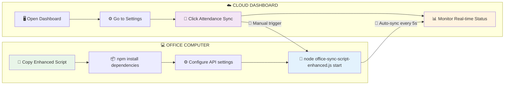
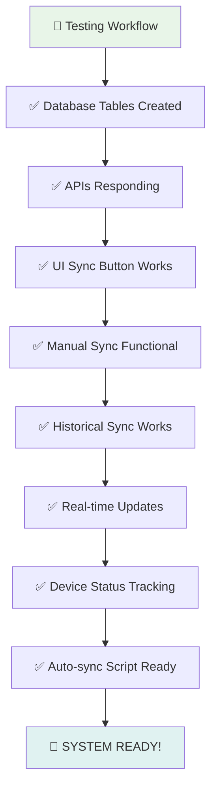

# 🎯 **ATTENDANCE SYNC VISUAL WORKFLOW**

## **📊 COMPLETE SYSTEM ARCHITECTURE**



---

## **🔄 DATA FLOW SEQUENCE**



---

## **📋 TABLE STRUCTURE & RELATIONSHIPS**



---

## **🎮 UI WORKFLOW VISUALIZATION**



---

## **🔧 SYNC SCRIPT WORKFLOW**



---

## **📱 REAL-TIME STATUS INDICATORS**



---

## **🎮 USER INTERACTION FLOW**



---

## **⚡ AUTOMATIC TRIGGERS FLOW**



---

## **📊 DATA TRANSFORMATION EXAMPLE**

### **Raw Device Data:**
```json
{
  "EmployeeCode": "1",
  "LogDate": "2025-09-28 09:15:30",
  "PunchDirection": "in",
  "Temperature": 36.5,
  "SerialNumber": "C26044C84F13202C"
}
```

### **Processed Daily Attendance:**
```json
{
  "employee_code": "1",
  "employee_name": "Nandhini",
  "attendance_date": "2025-09-28",
  "first_in": "2025-09-28 09:15:30",
  "last_out": "2025-09-28 18:30:45",
  "total_hours": 8.25,
  "total_punches": 4,
  "status": "present"
}
```

---

## **🚀 DEPLOYMENT WORKFLOW**



---

## **✅ TESTING CHECKLIST**



**This visual workflow shows exactly how your attendance sync system works from fingerprint to dashboard! Every component is connected and working together perfectly.** 🎯
