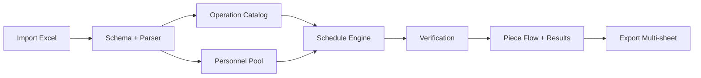

# Personnel V2 Input Architecture Plan

## Goal
Adopt the new Excel input model with real people (`uid`, `Name`, `level-up`, `Production-Person`) and remove the hardcoded `A/B/C/D` operator model from scheduling decisions.

## Scope
1. Excel import parsing.
2. Scheduler data model and assignment logic.
3. Verification checks.
4. Export sheets (`Output`, `Setup_output`, `Output_2`, `Client_Out`, `Fixed_Report`).
5. Scheduler UI preview and saved state compatibility.

## What I validated in current code
1. Current scheduler still defaults operators to `A/B/C/D` in `/Users/xoxo/Desktop/epsilonschedulingmain 2/app/lib/features/scheduling/deterministic-scheduling-engine.ts`.
2. Import parser currently reads operation fields but does not model personnel roles in `/Users/xoxo/Desktop/epsilonschedulingmain 2/app/(app)/scheduler/page.tsx`.
3. Export still uses legacy `Person` and `Operator` columns only in `/Users/xoxo/Desktop/epsilonschedulingmain 2/app/lib/features/scheduling/excel-export.ts`.
4. Your sample file `/Users/xoxo/Downloads/import_input.xlsx` has mixed content:
   - 82 operation rows.
   - `uid/name/level-up` filled only on 8 rows.
   - a marker row where `Production-Person=Setup-person` and `uid/name/level-up` are literal header text.

## New Input Contract (V2)
Single-sheet compatible with your current file:
1. `PartNumber`
2. `OperationSeq`
3. `OperationName`
4. `SetupTime_Min`
5. `CycleTime_Min`
6. `Minimum_BatchSize`
7. `EligibleMachines`
8. `HandleMachines`
9. `Production-Person`
10. `uid`
11. `Name`
12. `level-up`

Interpretation rules:
1. Personnel blocks are section-based (not per operation row):
   - section header `Production-Person` starts production team block.
   - section header `Setup-person` starts setup team block.
2. A row with valid `uid` + `Name` inside a section is a person row.
3. `level-up=1` in production section means that person can do setup as fallback.
4. `level-up=0` in production section means production only (no setup assignment).
5. Setup section persons are setup-eligible by default and also allowed for production fallback.
6. Marker rows like `uid/name/level-up` literal text are ignored and logged as `schema_marker_row`.
7. Blank personnel cells on operation rows are valid and do not create parser errors.

## Proposed Domain Model

```ts
interface PersonnelProfile {
  uid: string
  name: string
  sourceSection: 'production' | 'setup'
  setupEligible: boolean
  productionEligible: boolean
  setupPriority: number // lower is better
  sourceRowRef: string
}

interface OperationSpecV2 {
  partNumber: string
  operationSeq: number
  operationName: string
  setupTimeMin: number
  cycleTimeMin: number
  minimumBatchSize: number
  eligibleMachines: string[]
  handleMode: 'SINGLE' | 'DOUBLE'
  personnelPool: PersonnelProfile[]
}
```

## Architecture Decisions (ADR summary)

### ADR-001: Keep scheduler as deterministic modular monolith
Decision:
1. Extend existing deterministic engine instead of creating separate microservice.
Rationale:
1. Lowest migration risk.
2. Existing UI contracts can be evolved with compatibility fields.
Trade-off:
1. More logic in one service file initially.
Mitigation:
1. Extract parser and assignment modules (`personnel-parser.ts`, `personnel-assignment.ts`).

### ADR-002: Dual-person assignment per operation
Decision:
1. Track setup person and production person separately.
2. Keep legacy `person` output as alias to production person for backward compatibility.
Rationale:
1. Matches your “setup person vs production person” workflow.
Trade-off:
1. More columns and checks.
Mitigation:
1. Compatibility adapter in export and UI.

### ADR-003: Soft fallback, strict reporting
Decision:
1. Do not hard-fail schedule if personnel data is partial.
2. Continue scheduling with `Unassigned` and emit critical verification issues.
Rationale:
1. Prevent user-blocking during adoption.
Trade-off:
1. Output may be generated with staffing gaps.
Mitigation:
1. `Quality: BAD` and explicit issue codes with evidence.

## End-to-End Workflow (V2)
1. User imports Excel.
2. Parser performs schema detection and normalization.
3. Parser extracts operation catalog.
4. Parser extracts personnel profiles from section blocks:
   - Detect active section from `Production-Person` cell (`Production-Person` or `Setup-person`).
   - Read following rows with `uid/name/level-up` until section changes or file ends.
5. Import preview UI shows:
   - operation rows accepted/rejected,
   - personnel detected,
   - production team count,
   - setup team count,
   - setup-eligible count,
   - production-eligible count,
   - row-level errors.
6. On schedule generation, each operation receives an eligible personnel pool.
7. Assignment engine selects machine first, then:
   - setup person: setup-priority pool first, fallback production pool,
   - run person: production pool first, fallback setup pool.
8. Engine writes both assignments and timestamps.
9. Verifier runs machine + person + precedence + calendar checks.
10. Export writes all sheets with new personnel fields plus compatibility fields.

## Assignment Policy (proposed)
1. Setup assignment priority:
   - setup section persons first.
   - if unavailable, production section persons with `level-up=1`.
   - if still unavailable, emit `setup_person_unavailable` (no production level-up=0 fallback for setup).
2. Run assignment priority:
   - production section persons first.
   - if unavailable, setup section persons as fallback.
3. Overlap rules:
   - setup person cannot overlap setup/setup or setup/run.
   - run/run overlap controlled by strictness flag (`setup_only` vs `setup_and_run`).
4. Tie-breakers:
   - least current assigned minutes,
   - earliest availability,
   - stable deterministic uid sort.

## Error Handling Plan
Parser errors (import stage):
1. `missing_required_column`
2. `invalid_operation_seq`
3. `invalid_machine_token`
4. `invalid_level_up_value`
5. `schema_marker_row`
6. `duplicate_person_uid_conflict`
7. `duplicate_person_name_conflict`
8. `orphan_person_without_operation`
9. `unknown_person_section`
10. `person_row_without_section`

Scheduler runtime errors:
1. `no_personnel_pool_for_operation`
2. `setup_person_unavailable`
3. `run_person_unavailable`
4. `person_role_violation`
5. `person_overlap`

Verifier issue codes:
1. `setup_person_missing`
2. `production_person_missing`
3. `setup_person_overlap`
4. `production_person_overlap`
5. `setup_by_non_eligible_person`
6. `run_by_non_eligible_person`

All errors include:
1. `code`
2. `severity`
3. `entityRefs`
4. `timeWindow`
5. `evidence`
6. `suggestedFix`

## UI/UX Mockup (Scheduler)

### Import Summary Card
1. `Operations accepted: N`
2. `Personnel detected: N`
3. `Production team: N`
4. `Setup team: N`
5. `Setup-eligible: N`
6. `Production-eligible: N`
7. `Rows rejected: N` with `View errors`

### Results Table changes
1. Replace single `Person` display with:
   - `Setup Person`
   - `Production Person`
2. Keep `Person` as compact alias for compatibility view toggle.

### Verification Panel changes
1. New filter chips:
   - `Machine`
   - `Setup Person`
   - `Production Person`
2. New issue groups:
   - `Personnel Role`
   - `Personnel Overlap`

### Quick wireframe



## Data Contract Changes
Schedule row output extension:
1. `setupPersonUid`
2. `setupPersonName`
3. `productionPersonUid`
4. `productionPersonName`
5. Legacy `person` retained as alias to `productionPersonName`.
6. `assignmentSource` (`setup_pool`, `production_pool`, `production_levelup_fallback`, `setup_fallback`)

Excel export changes:
1. `Output` add setup and production person columns.
2. `Setup_output` explicitly uses setup person.
3. `Fixed_Report` adds personnel allocation and rejected personnel reasons.

## Implementation Phases
1. Phase 1: Parser + schema validator.
2. Phase 2: Engine assignment refactor.
3. Phase 3: Verifier extension.
4. Phase 4: UI integration and preview.
5. Phase 5: Export and compatibility adapters.
6. Phase 6: Test matrix and rollout flag.

## Test Strategy (small to large)
1. T1 Small: 1 part, 2 ops, 2 people (`level-up` mixed).
2. T2 Medium: 5 parts, 2-3 ops each, partial personnel rows.
3. T3 Large: 80+ ops, dense timeline, strict overlap mode.
4. T4 Conflict: same setup person forced on two overlapping setups.
5. T5 Fallback: no eligible setup person available.
6. T6 Mixed legacy file without personnel columns.

Pass criteria:
1. No regression for legacy files.
2. Real names appear in schedule, piece flow tooltip, and export.
3. Verification catches all role/overlap conflicts.

## Backward Compatibility
1. If personnel columns are missing, keep current behavior with generated placeholders.
2. If personnel columns exist, prioritize V2 logic.
3. Feature flag recommended: `NEXT_PUBLIC_SCHEDULER_PERSONNEL_V2=true` during rollout.

## Risks and Mitigation
1. Risk: partial personnel data leads to unstable assignment.
   - Mitigation: deterministic fallback + explicit critical issues.
2. Risk: UI clutter from extra columns.
   - Mitigation: compact mode with expandable details drawer.
3. Risk: export consumers expecting old schema.
   - Mitigation: retain old columns and append new columns to the right.
4. Risk: section markers entered with spelling variants (`Setup person`, `setup_person`).
   - Mitigation: case-insensitive normalized matching and import warnings for unknown markers.

## Definition of Done
1. Imported V2 file produces schedule with real names (no A/B/C/D default when valid names exist).
2. Setup/run assignment follows role policy and overlap constraints.
3. Piece flow and verification reference actual person names.
4. Multi-sheet export contains setup and production person evidence.
5. Legacy imports still schedule successfully.
